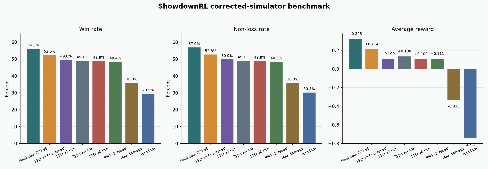

# ShowdownRL

[](https://github.com/AnanmayS/ShowdownRL/actions/workflows/ci.yml)

Watch an AI play Pokemon Showdown in a visible browser.

## About

ShowdownRL is a local command-line tool for watching an automated Pokemon
Showdown player in action. It opens the real Pokemon Showdown website, signs in
with your account or a guest name, queues a Random Battle, and clicks moves in a
visible browser so you can follow every decision.

The live player can use a lightweight heuristic policy or a trained PPO move
selector. It can also save WebM recordings, write local battle stats, and
generate local reports for comparing runs over time. Credentials, battle logs,
debug snapshots, recordings, and stats stay on your machine unless you choose to
share them.

## Current AI Benchmark

The default trained simulator policy is
`maskable_ppo_move_selection_v6_rich.zip`. It trains MaskablePPO with
state-dependent action masks that filter tactical no-op moves such as full-HP
recovery, over-stacking setup, and repeated status drops.
The rich PPO input extends the original 14-feature observation with per-move
context for expected damage, STAB, type advantage, finish ranges, recovery,
setup, and status moves.



This chart is generated from the published benchmark data in
[docs/benchmarks/current_evaluation.csv](docs/benchmarks/current_evaluation.csv).
It summarizes the two rich/type-aware evaluation seeds, with 1,000 simulator
episodes per seed. The benchmark uses the corrected simulator where the
opponent receives its own hidden move set instead of reusing the agent's moves.

| Scenario | Policy | Episodes | Record (W-D-L) | Win rate | Avg reward | Avg turns |
| --- | --- | ---: | ---: | ---: | ---: | ---: |
| Rich/type-aware seed 42 | Maskable PPO v6 | 1000 | 565-8-427 | 56.5% | +0.338 | 6.51 |
| Rich/type-aware seed 42 | Fine-tuned PPO v5 | 1000 | 527-3-470 | 52.7% | +0.222 | 6.16 |
| Rich/type-aware seed 42 | Trained PPO v3 | 1000 | 498-3-499 | 49.8% | +0.116 | 6.23 |
| Rich/type-aware seed 42 | Type aware | 1000 | 494-0-506 | 49.4% | +0.149 | 5.58 |
| Rich/type-aware seed 42 | Experimental PPO v4 | 1000 | 492-0-508 | 49.2% | +0.122 | 5.71 |
| Rich/type-aware seed 99 | Maskable PPO v6 | 1000 | 559-9-432 | 55.9% | +0.312 | 6.63 |
| Rich/type-aware seed 99 | Fine-tuned PPO v5 | 1000 | 523-4-473 | 52.3% | +0.206 | 6.17 |
| Rich/type-aware seed 99 | Trained PPO v3 | 1000 | 494-4-502 | 49.4% | +0.102 | 6.25 |
| Rich/type-aware seed 99 | Type aware | 1000 | 488-1-511 | 48.8% | +0.126 | 5.63 |
| Rich/type-aware seed 99 | Experimental PPO v4 | 1000 | 485-1-514 | 48.5% | +0.097 | 5.77 |

Records are shown as wins-draws-losses. See
[docs/benchmarks/current_evaluation.csv](docs/benchmarks/current_evaluation.csv)
and [docs/model_leaderboard.md](docs/model_leaderboard.md) for the side-by-side
benchmark data.

## Install

For the first public version, install directly from GitHub with `pipx`:

```bash
pipx install "git+https://github.com/AnanmayS/ShowdownRL.git"
```

For local development from this folder:

```bash
python3 -m venv .venv
.venv/bin/pip install -e .
```

## First Run

Run the setup wizard:

```bash
showdownrl setup
```

Setup will:

- install Playwright Chromium
- ask for your Pokemon Showdown username and password
- save credentials locally in `~/Library/Application Support/ShowdownRL/config.env`

Your password is only sent to Pokemon Showdown during login. It is not uploaded
anywhere else by ShowdownRL.

Use guest mode instead of a password:

```bash
showdownrl setup --guest
```

## Check Everything

Before queueing a battle:

```bash
showdownrl check
```

To only verify the public website controls without logging in:

```bash
showdownrl check --skip-login
```

## Watch the AI Play

```bash
showdownrl live
```

Useful options:

```bash
# Stop after login, before queueing
showdownrl live --login-only

# Run without recording
showdownrl live --no-record

# Slow the clicks down
showdownrl live --slow-mo-ms 500 --click-delay 1.25

# Limit the battle loop for a smoke test
showdownrl live --max-turns 3

# Play more than one battle in the same run
showdownrl live --max-battles 3

# Stop a long session after 30 minutes
showdownrl live --max-battles 50 --max-time 30

# Show move scores while the AI is choosing
showdownrl live --debug-policy

# Try the trained PPO move selector, falling back to the heuristic if needed
showdownrl live --policy ppo

# Use a specific PPO checkpoint
showdownrl live --policy ppo --model-path models/maskable_ppo_move_selection_v6_rich.zip

# Do not write local battle stats
showdownrl live --no-stats
```

Recordings are saved to `~/Movies/ShowdownRL/` when installed normally. If you
run from this repository folder, recordings are saved to `results/`.

## Live Stats

`showdownrl live` writes local battle stats by default. Stats are stored on your
machine only and are not uploaded by ShowdownRL.

Print a terminal summary:

```bash
showdownrl stats
```

Generate a local HTML report:

```bash
showdownrl stats --html
showdownrl stats --open
showdownrl stats --trend
```

Filter the report:

```bash
showdownrl stats --since 2026-06-23
showdownrl stats --format "Random Battle"
```

Stats are saved under the local app data directory, separate from the config
file that stores credentials. You can override the location for a run:

```bash
showdownrl live --stats-dir ./my-stats
showdownrl stats --stats-dir ./my-stats
```

## Account and Privacy

Delete saved local credentials:

```bash
showdownrl logout
```

Print diagnostics without exposing secrets:

```bash
showdownrl doctor
```

You can also use environment variables for one-off overrides:

```bash
PS_USERNAME=your_name PS_PASSWORD=your_password showdownrl live
```

Battle logs do not store your password. They include local-only battle metadata
such as result, turns, selected moves, forced switches, policy source, rating
when it can be detected from the page, errors, and video path.
When `--debug-policy` is used, ShowdownRL also saves local redacted turn-state
snapshots under the stats directory so you can inspect what the AI saw before
clicking.

## Troubleshooting

- Missing Chromium: run `showdownrl setup`.
- Missing credentials: run `showdownrl setup` or use `showdownrl live --guest --username SomeGuestName`.
- Login failed: run `showdownrl logout && showdownrl setup`.
- Website controls changed: run `showdownrl doctor`, then `showdownrl check --skip-login`.
- Stats look empty: play a full battle with `showdownrl live`, then run `showdownrl stats`.

## Developer Notes

The current public CLI focuses on the live AI player for
`https://play.pokemonshowdown.com/`.

The repository also contains experimental reinforcement-learning scripts under
`scripts/` and helper modules in `showdownrl/`:

```bash
pip install -e ".[rl]"
python scripts/smoke_test.py
python scripts/train_ppo.py --timesteps 2048 --mechanics rich --observation-mode rich --opponent-policy type_aware --output models/ppo_smoke.zip
python scripts/evaluate_model.py --episodes 100 --mechanics rich --opponent-policy type_aware --model models/ppo_smoke.zip
python scripts/regenerate_benchmarks.py --dry-run --episodes 2
python scripts/run_experiments.py --dry-run --timesteps 2048 --episodes 20
python scripts/run_experiments.py --dry-run --tune-trials 4 --timesteps 2048 --episodes 20
PYTHONPATH=. python -m unittest discover -s tests
```

Those training/evaluation workflows are not part of the v1 nontechnical user
flow yet.
